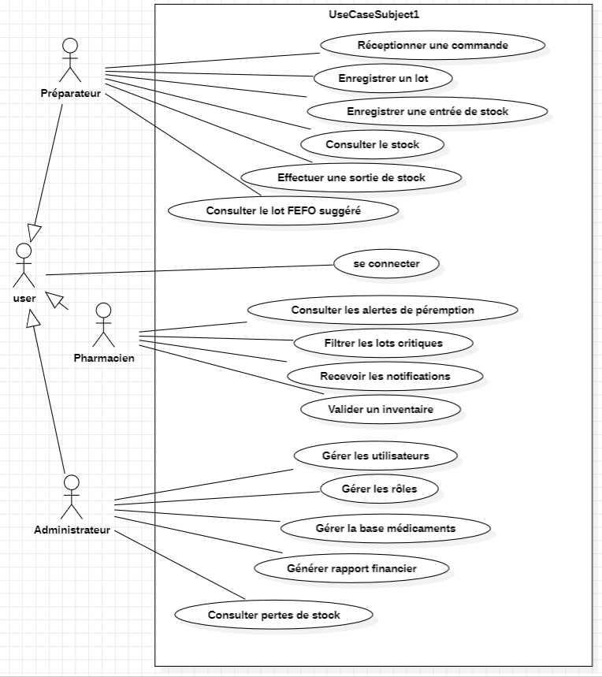
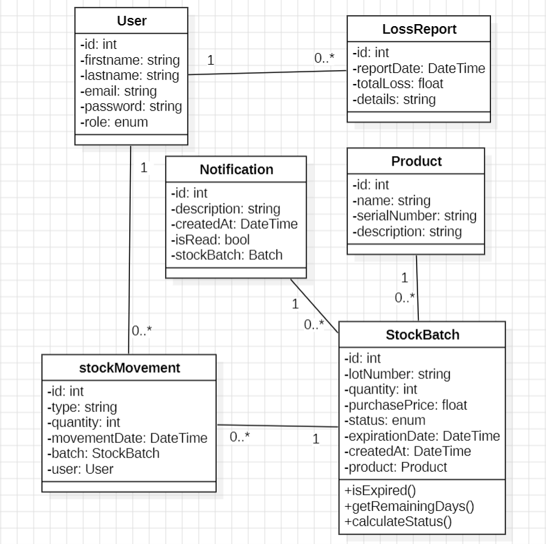
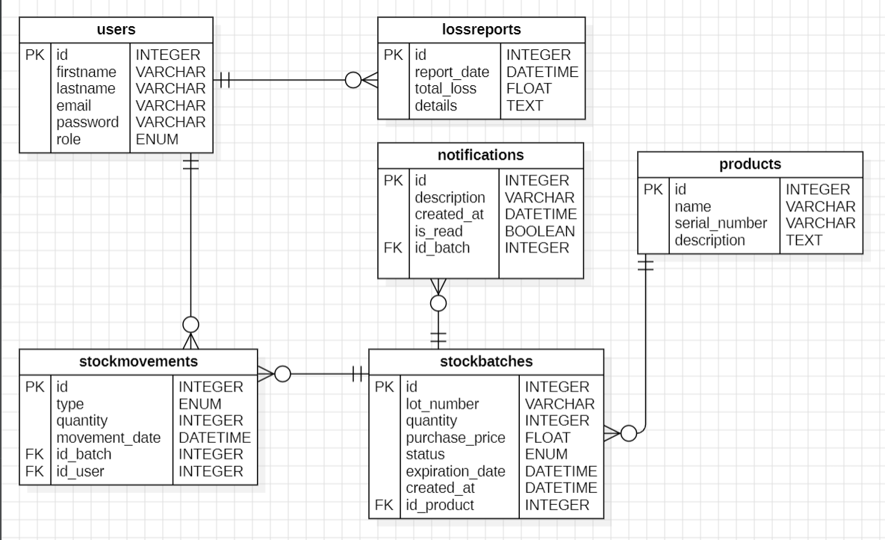

# PharmaFEFO - Application d'Optimisation des Stocks Pharmaceutiques

### 📋Description

PharmaFEFO est une application web de gestion des stocks pharmaceutiques basée sur la méthode FEFO (First Expired, First Out). Son objectif est d'aider les pharmacies d'officine et les cliniques à optimiser la gestion des médicaments en réduisant les pertes liées aux produits périmés et en garantissant une meilleure traçabilité des lots.

L'application permet de :

- Gérer les entrées de stock avec numéro de lot et date de péremption.
- Surveiller les produits proches de la péremption.
- Générer des alertes selon le niveau de criticité.
- Appliquer automatiquement la règle FEFO lors des sorties de stock.
- Déclarer les lots périmés.
- Générer des rapports financiers sur les pertes de stock.

## 🚀 Fonctionnalités

### Gestion des Entrées de Stock
- Enregistrement des commandes reçues.
- Saisie du numéro de lot.
- Saisie de la date de péremption.
- Validation des données avant enregistrement.
### Surveillance des Péremptions
- Affichage des lots selon leur criticité :
🟢 Vert : plus de 6 mois avant expiration.
🟠 Orange : moins de 90 jours.
🔴 Rouge : moins de 30 jours.
- Filtrage des alertes rouges.
- Notifications des produits proches de la péremption.
### Gestion FEFO
- Sélection automatique du lot dont la date de péremption est la plus proche.
- Décrémentation automatique du stock concerné.
- Historique des mouvements de stock.
### Gestion des Pertes
- Déclaration des lots périmés.
- Retrait automatique du stock disponible.
- Gestion des retours fournisseurs.
- Rapport financier des pertes.
## 👥 Rôles Utilisateurs

### Préparateur / Gestionnaire de Stock
- Réception des commandes.
- Enregistrement des lots.
- Gestion des sorties de stock.
- Application de la règle FEFO.
### Pharmacien Titulaire
- Consultation des alertes de péremption.
- Validation des inventaires.
- Gestion des retours fournisseurs.
- Déclaration des lots périmés.
### Administrateur
- Gestion des utilisateurs.
- Gestion des rôles.
- Gestion de la base des médicaments.
- Génération des rapports financiers.
## 🏗️ Architecture du projet

Le projet suit une architecture MVC (Model View Controller).

pharmafefo/
│

├── config/

│   └── database.php
│

├── public/

│   ├── css/

│   └── index.php
│

├── src/

│   ├── Controller/

│   ├── Entity/

│   ├── Enum/

│   └── Repository/

│
└── templates/

    ├── dashboard/
    
    └── layout/
## 🛠️ Technologies Utilisées

- PHP 8+
- MySQL
- PDO
- HTML5
- CSS3
- JavaScript
- MVC Architecture
- UML
- Jira
- Git & GitHub
## 📊 Diagrammes UML

# diagramme de cas d'utilisation

# diagramme de classe

# diagramme ERD

## 👨‍💻 Auteur
Projet réalisé dans le cadre de la formation Développeur Web et Web Mobile (DWWM).

Nom : badr belabrik

Année : 2026